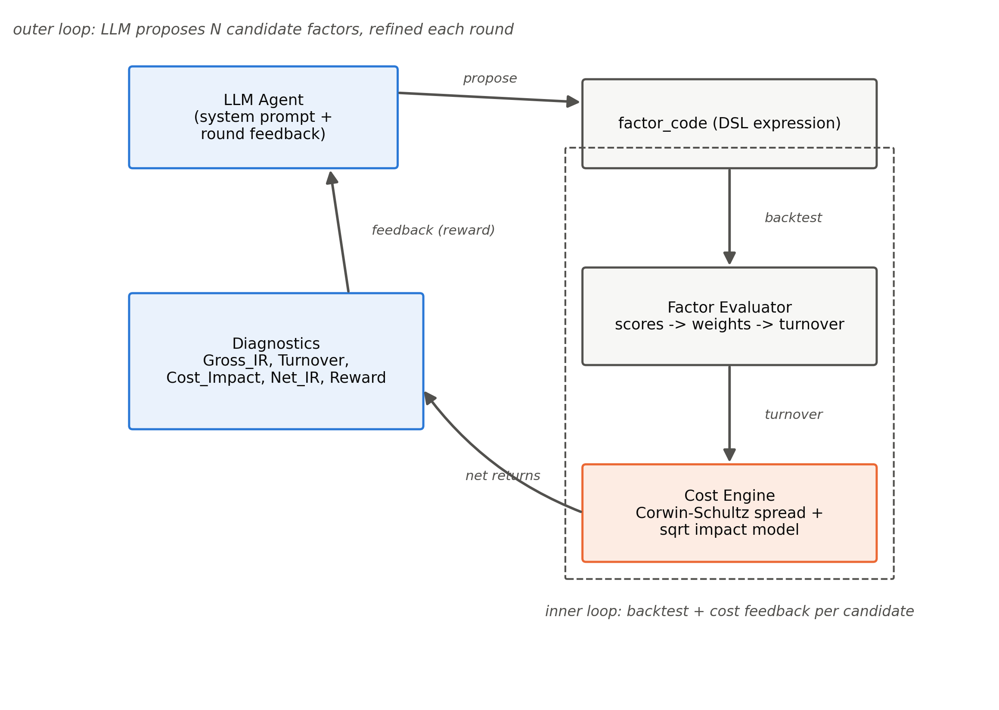
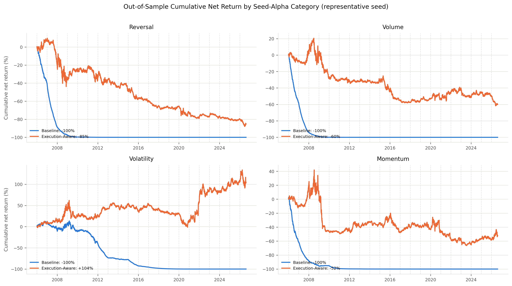
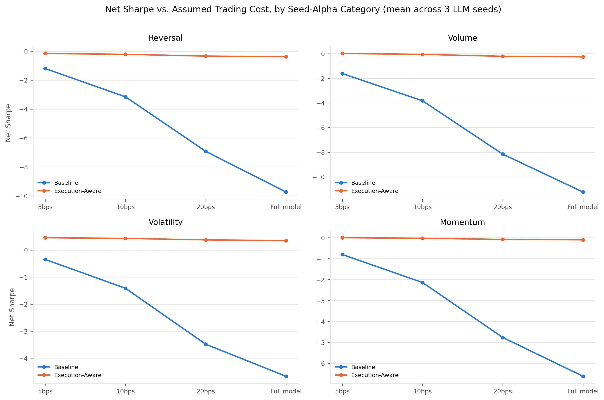

# Execution-Aware Alpha Mining: Teaching LLM Factor Agents to Account for Trading Costs

**Raghuram Nagireddy** (ORCID: 0009-0002-2203-3367)

Independent researcher. Email: rrn2111@caa.columbia.edu

*Prepared for submission to Finance Research Letters*

---

## Highlights

- An LLM mines equity factors under a raw-return reward vs. a cost-penalized reward.
- A 21-fold walk-forward test (2006-2026) uses point-in-time S&P membership.
- Cost-blind search reaches 49-101%/day turnover and loses its notional in all four.
- Penalizing turnover cuts it 22-38x and makes one category net profitable.
- Net Sharpe gains +9.96 (95% CI 8.3-11.6) in a cluster bootstrap over 252 folds.

## Abstract

Large language model (LLM) agents increasingly generate candidate trading signals, but many "alpha mining" pipelines reward the agent on in-sample return quality alone, leaving transaction costs to be discovered at implementation. We build a closed-loop system in which a locally-hosted LLM (Qwen2.5-Coder-14B-Instruct) proposes daily cross-sectional equity factors in an AST-validated expression language; each candidate is backtested on a reconstructed point-in-time S&P universe (1999-2026, not a survivorship-biased snapshot) and priced with an explicit spread-and-impact transaction-cost model; diagnostics feed back to the agent every round. We isolate the effect of an execution-cost penalty in the search objective using matched, independently seeded re-optimizations: 21 five-year-train/one-year-test walk-forward folds (2006-2026) crossed with four seed alphas from distinct predictor categories (reversal, volume, volatility, momentum) and three LLM seeds, for 12 re-optimized comparisons. An agent rewarded purely on gross return converges to 49-101%/day turnover in every category and produces a -100% cumulative return (net Sharpe -4.7 to -11.2) despite positive average gross Sharpe (0.67); a cluster bootstrap over the 252 underlying fold-level comparisons (paired execution-aware minus baseline) puts the Net Sharpe improvement at +9.96 (95% CI [8.3, 11.6]). Rewarding the identical search net of cost cuts turnover 22-38x, drives near-universal adoption of long-lookback smoothing operators, and, for the volatility-anomaly seed, produces a net-profitable factor (Sharpe +0.35, CAGR ~3.8%). The other three categories remain net-negative, by substantially smaller margins. These results identify the objective specification of an automated search as an economically consequential research choice in its own right.

**Keywords:** LLM agents; alpha mining; transaction costs; factor turnover; execution-aware backtesting; point-in-time universe

**JEL classification:** G11, G12, C45, C63

---

## 1. Introduction

Generative language models are now routinely used as a search process over candidate trading signals: an LLM proposes a factor expression, a backtest scores it, and the loop repeats (in the spirit of automated formulaic-alpha search, Kakushadze, 2016). This turns factor discovery into a search problem in which the reward function *is* the research objective. If that reward is gross in-sample return quality — the default in almost every published or informally circulated pipeline — the search will systematically favor short-horizon, high-turnover signals, because fast cross-sectional effects are well known to carry attractive raw Sharpe ratios that are largely compensation for the spread and impact a real trader would pay to capture them (Novy-Marx and Velikov, 2016; Korajczyk and Sadka, 2004).

This paper sits alongside a fast-moving literature on LLM-based financial agents: open-source financial LLMs (Yang, Liu and Wang, 2023); a regularized-exploration framework that penalizes low originality and overfitting-prone complexity to counteract alpha decay (Tang et al., 2025); and evidence that an LLM's own output variability across repeated queries is itself a source of implied turnover and cost in LLM-driven stock selection (Chon, Kim and Kim, 2025). Closest to our design, an LLM-guided Monte Carlo tree search aggregates turnover alongside four other criteria into one equally-weighted composite reward, and reports via a cumulative ablation that adding turnover improves practical trading metrics (Shi, Duan and Li, 2026). That evidence is consistent with our findings, but the design differs in two respects: turnover enters as one percentile-ranked input among several rather than an explicit dollar-cost model, and the ablation adds evaluation criteria cumulatively rather than holding all else fixed while varying the reward. Our design instead isolates the reward as the *sole* controlled treatment — identical model, sampling seed, search budget, and starting expression, an explicit spread-and-impact cost model rather than a percentile score, and repeated long-horizon walk-forward re-optimization. Against that backdrop we ask whether telling a factor-mining LLM agent about turnover and cost *during* the search, not only at final evaluation, changes what it finds and whether that finding survives cost better. We build a reproducible pipeline: an LLM proposes factor expressions in a whitelisted, AST-validated expression grammar over price-volume panels; each candidate becomes a daily-rebalanced, dollar-neutral long/short portfolio; its cost is priced with a Corwin and Schultz (2012) spread estimator plus a square-root impact model; and the resulting diagnostics are returned to the agent. We compare two reward specifications on the identical loop — a *baseline* agent rewarded on gross return quality alone, and an *execution-aware* agent rewarded net of an explicit turnover and cost penalty — each bootstrapped from the same seed expression and LLM sampling seed, so the two searches differ only in reward.

Two design choices distinguish this study from related work. First, we use reconstructed point-in-time S&P constituent membership (1999-2026) rather than a present-day snapshot, avoiding the survivorship bias that a static universe of currently-listed names introduces into any long-history backtest. Second, we cross four seed alphas from economically distinct predictor categories — short-term reversal (Jegadeesh, 1990), abnormal-volume fade (Gervais, Kaniel and Mingelgrin, 2001), the low-volatility anomaly (Ang, Hodrick, Xing and Zhang, 2006), and cross-sectional momentum (Jegadeesh and Titman, 1993) — with three independent LLM sampling seeds each, yielding 12 independently seeded re-optimizations. The contribution is a controlled comparison: matched searches that differ *only* in reward, isolating the objective function's effect from confounds of model choice, universe, or search budget, and testing that effect across both sampling randomness and the economic mechanism the search is warm-started from.

## 2. Data and Methodology

**Point-in-time universe.** We reconstruct true historical S&P constituent membership (1999-2026) from a public historical-components record, sourcing daily OHLCV from a local multi-vendor price archive supplemented by a Yahoo Finance gap-fill; combined coverage of point-in-time constituents ranges from roughly 75% (2001) to 99% (2026). For compute tractability, each walk-forward fold trades a liquidity-capped subset (~150-220 tickers) selected by trailing two-year dollar volume, reconstituted annually *within* each fold using only data available as of each reconstitution date (never the fold's own future), so universe selection is causal at every point (Appendix A.1).

**Cost engine.** Bid-ask spread is estimated per stock-day from the Corwin and Schultz (2012) high-low estimator (bounded to 1-100bps); impact follows a square-root law, `Impact = Y * sigma_daily * sqrt(participation)`, with `Y = 0.5` (Grinold and Kahn, 2000) and participation measured against 21-day average dollar volume. Daily cost drag is this one-way cost applied to that day's dollar weight change, summed across the book and subtracted from gross return. Target weights derived from a factor score computed on day t's inputs are lagged one day before being applied, so a position earns the close[t]-to-close[t+1] return rather than the return already realized when the signal was formed; no same-day price information enters the reward.

**Factor language and guardrails.** Factor candidates are single-line expressions over a whitelisted operator set (`cs_rank`, `ts_rank`, `zscore`, `decay_linear`, `sma`, `stddev`, arithmetic) applied to `open/high/low/close/volume/vwap`, parsed with Python's `ast` module and rejected unless every node is whitelisted before evaluation. Beyond syntax whitelisting, six hard anti-pattern rules reject redundant ranking, no-op scalar rescaling, cascading smoothers, unprotected division, unbounded powers, and out-of-range lookback windows (2-252 days) before a candidate is ever backtested (Appendix A.2).

**Agent and reward.** Figure 1 summarizes the closed loop linking these components. The Generator/Refiner is Qwen2.5-Coder-14B-Instruct (Q4\_K\_M, run locally via llama.cpp, temperature 0.7 — validated against temperature 0 and 0.3, both of which collapse to a fixed point after 1-2 rounds rather than sustaining search, Appendix A.3). Each of the two reward conditions uses an independently-constructed, identically-seeded LLM client bootstrapped from the same seed alpha, matching the two conditions on starting expression, sampling seed, and 50-round budget, and leaving the reward as the only difference between them. Baseline reward is Gross\_IR; execution-aware reward is `Gross_IR - gamma1*Turnover - gamma2*Cost_Impact` (gamma1=0.5, gamma2=8), both penalized identically for expression complexity above an 8-node budget. Turnover is computed against the drift-adjusted pre-rebalance weight (not the prior day's stale target), avoiding double-counting passive price drift as a trade (Appendix A.4).

**Walk-forward design.** Iterated search over many candidates scored on the same data can overstate apparent skill even absent true edge (Bailey et al., 2014), so we favor rolling re-search with held-out evaluation over a single train/test split (López de Prado, 2018). Twenty-one non-overlapping-test rolling folds span the point-in-time sample: a 5-year train window, immediately followed by a 1-year test window, rolling forward one year at a time, with test windows from 2006 through mid-2026. On each fold the agent runs its full 50-round search restricted to that fold's train window; the winning factor is frozen and scored once on the held-out test window; the 21 folds' out-of-sample return streams are stitched into one continuous curve per (seed alpha, sampling seed, mode). We report the average daily turnover and its inverse, the average holding period in trading days, alongside net Sharpe under the full cost model and flat 5/10/20bps scenarios.

## 3. Results

Table 1 reports each category's stitched walk-forward result, averaged across the three LLM sampling seeds (standard deviation in parentheses).

**Table 1. Baseline vs. execution-aware, by seed-alpha category, averaged across 3 LLM sampling seeds (21 folds each, test periods 2006-2026)**

| Seed alpha | Mode | Net Sharpe (full cost) | Avg. daily turnover | Avg. holding period (days) | Cumulative return |
|---|---|---:|---:|---:|---:|
| Reversal | Baseline | -9.74 (0.80) | 92.3% | 1.1 | -100% |
| Reversal | Execution-aware | -0.38 (0.20) | 4.2% | 24.2 | -77% |
| Volume | Baseline | -11.24 (1.27) | 100.8% | 1.0 | -100% |
| Volume | Execution-aware | -0.25 (0.18) | 4.1% | 24.3 | -55% |
| Volatility | Baseline | -4.67 (0.91) | 49.0% | 2.0 | -100% |
| Volatility | Execution-aware | **+0.35 (0.02)** | 1.4% | 71.2 | **+117%** |
| Momentum | Baseline | -6.61 (1.21) | 70.8% | 1.4 | -100% |
| Momentum | Execution-aware | -0.10 (0.03) | 1.8% | 54.2 | -47% |

Figure 2 plots the stitched cumulative net return for one representative sampling seed per category; Figure 3 plots Net Sharpe against the assumed one-way cost, from a lenient 5bps flat assumption up to the full spread-and-impact model, for the mean across all three sampling seeds.

**Table 2. Modal winning factor per category and mode** (the single most frequently re-discovered expression across the 63 fold x sampling-seed instances per cell; repeat count in parentheses)

| Seed alpha | Baseline (repeats/63) | Execution-aware (repeats/63) |
|---|---|---|
| Reversal | `rank(-1 * delta(close, 1))` (2) | `decay_linear(cs_rank(-1 * delta(close, 252)), 252)` (9) |
| Volume | (heterogeneous; top expr. 1/63) | `decay_linear(cs_rank(-1 * zscore(volume, 252)), 252)` (14) |
| Volatility | `rank(-1 * stddev(delta(close,1),20) + cs_rank(volume))` (2) | `decay_linear(rank(-1 * stddev(delta(close,1),20)), 240)` (18) |
| Momentum | (heterogeneous; top expr. 2/63) | `decay_linear(cs_rank(delta(close,240)/(stddev(delta(close,1),240)+1e-5)), 252)` (22) |

Four findings emerge. First, the baseline loses its entire notional in *every* category: 49-101%/day turnover rotates the book roughly once to twice daily, a trading pace a reward function blind to cost has no reason to avoid. The baseline nonetheless attains positive average gross out-of-sample Sharpe across categories (0.67: reversal 0.77, volume 0.62, volatility 0.73, momentum 0.55). The cost-blind search therefore locates signals with positive pre-cost out-of-sample performance, which trading frictions subsequently overwhelm.

Second, penalizing turnover and modeled cost inside the reward — nothing else about the search, universe, or cost model changes — cuts turnover 22x (reversal) to 38x (momentum) in every category. This comparison pools 252 fold-level observations (21 folds x 12 seed-alpha/sampling-seed combinations). Because folds within a combination share overlapping five-year training windows, they are not independent replicates, so we resample whole combinations rather than individual folds. A cluster bootstrap over the 12 combinations puts the mean fold-level Net Sharpe improvement (paired execution-aware minus baseline) at +9.96 (95% CI [8.3, 11.6]), with execution-aware superior on 87-97% of individual folds within every category. As a complementary check at the cluster level itself, all 12 combination-level mean deltas are positive (exact sign test, p=0.0005).

Third, the volatility-anomaly seed's execution-aware factor is net profitable across all three sampling seeds (net Sharpe +0.33 to +0.37; CAGR 3.5-4.1% over the 20.6-year stitched OOS record, 13.1-13.3% annualized volatility, maximum drawdown -33% to -40%), with the lowest turnover of any category (1.4%/day, a roughly 71-trading-day average holding period). The underlying pattern is clearest here: execution-aware's own gross Sharpe in this category (0.48 on average) is *lower* than the baseline's (0.73), yet its net outcome is substantially better. A moderately weaker pre-cost signal traded at a sustainable pace outperforms a stronger one traded at an unsustainable pace. The other three categories retain a smaller share of their gross edge under the execution-aware reward and remain net-negative, though by substantially smaller margins than their cost-blind counterparts.

Fourth, Table 2 indicates the mechanism: execution-aware winning factors use `decay_linear` in 100% of fold-seed instances (vs. 26% for baseline) with a mean lookback of 209 trading days (vs. 29 for baseline, and frequently at or near the 252-day ceiling), while also being structurally simpler (mean 6.1 AST operator nodes vs. 9.6). Execution-aware search also converges more reliably: its modal winning expression per category recurs in 14-22 of 63 fold-seed instances, versus 1-2 of 63 for the baseline, whose winning expression is rarely repeated. Cost-awareness thus redirects the search toward a narrow family of long-window, heavily-smoothed, structurally simpler expressions, providing a direct mechanism for the observed reduction in turnover.

Fifth, this result is not an artifact of the specific (gamma1=0.5, gamma2=8) weighting. Holding the search, universe, and cost model fixed, we reran the volatility category at one sampling seed across nine additional penalty settings spanning turnover-only, cost-only, and a combined midpoint; together with the (0.5, 8) setting above, ten configurations in total (Table 3). Every setting achieves positive net Sharpe (+0.02 to +0.45) and turnover 14-33x below the cost-blind baseline, with no configuration reproducing the baseline's collapse. The pattern is a threshold effect rather than a smoothly degrading frontier: turnover collapses as soon as any turnover penalty is applied and is then largely insensitive to its magnitude (gamma1 0.1 to 1.0), whereas the cost-only penalty is more sensitive at its weakest setting (gamma2=2, net Sharpe barely positive) before plateauing from gamma2=4 upward.

**Table 3. Penalty-sensitivity sweep, volatility category, sampling seed 1001**

| Setting | gamma1 | gamma2 | Net Sharpe (full cost) | Turnover (%/day) | Cumulative return |
|---|---|---|---|---|---|
| Baseline | 0 | 0 | -3.88 | 45.9% | -100% |
| Turnover-only | 0.1 | 0 | +0.45 | 1.5% | +184% |
| Turnover-only | 0.25 | 0 | +0.33 | 1.4% | +107% |
| Turnover-only | 0.5 | 0 | +0.35 | 1.4% | +118% |
| Turnover-only | 1.0 | 0 | +0.35 | 1.4% | +118% |
| Cost-only | 0 | 2 | +0.02 | 3.2% | -12% |
| Cost-only | 0 | 4 | +0.27 | 2.6% | +75% |
| Cost-only | 0 | 8 | +0.43 | 1.6% | +171% |
| Cost-only | 0 | 16 | +0.41 | 1.5% | +154% |
| Combined (midpoint) | 0.25 | 4 | +0.33 | 1.4% | +105% |
| Combined (main grid) | 0.5 | 8 | +0.33 | 1.4% | +104% |

## 4. Discussion and limitations

A reward penalizing turnover will mechanically produce low-turnover factors; the substantive question is whether that trade-off improves realized out-of-sample performance. The evidence bears on this from several directions: turnover falls 22-38x, gross Sharpe falls only modestly (in the volatility category, execution-aware's own gross Sharpe is *lower* than the baseline's), net Sharpe improves by a bootstrap-significant margin (+9.96, 95% CI [8.3, 11.6]) that holds across categories and sampling seeds, and the effect registers in expression structure (Table 2) as well as in performance. Under daily-rebalanced, dollar-neutral cross-sectional portfolio construction, the reward specification therefore materially determines the outcome, and a pipeline reporting a discovered factor's Sharpe without disclosing the reward function that produced it leaves that result difficult to interpret.

The magnitude of the baseline's net Sharpe warrants a sanity check. At a representative 85%/day turnover, the sample's median Corwin-Schultz half-spread (6.7bps) plus impact at a plausible participation rate implies roughly 20bps of one-way cost per unit traded, compounding to on the order of 85-90% of NAV per year in cost drag, sufficient to overwhelm a gross Sharpe of 0.5-0.9.

Several limitations qualify these results. The penalty-sensitivity sweep (Table 3) shows robustness within the volatility category to the choice of gamma1 and gamma2; which term is most responsible, and whether the pattern generalizes across all four predictor categories, remain open. The point-in-time universe's price coverage is incomplete pre-2010 (roughly 75-90% of true constituents), a data-availability constraint of free/quasi-free sources; because it affects both reward conditions identically within each fold, it should not bias the baseline-versus-execution-aware *comparison*, though it may affect absolute return levels in early folds. The liquidity cap (~150-220 tickers per fold, causally reconstituted) trades away some breadth for compute tractability, and the full ~500-name universe is a natural robustness check not yet run. The cost model's impact coefficient (`Y=0.5`) is not fit to realized execution data, which motivates the flat-cost sensitivity columns. Those columns share the model family used inside the reward, so they establish robustness to the assumed cost *level* rather than to the cost model's functional form. Portfolio construction is left unconstrained (daily rebalancing, no no-trade band), so the factor expression itself is the only turnover-reduction lever available to the search. Finally, the negative net Sharpe ratios in three of four categories should not be read as evidence that these predictor families are categorically unprofitable net of cost. They reflect an intentionally unforgiving stress test, uncontrolled 200%-gross daily rebalancing, chosen to make the cost channel and the agent's response to it observable; the volatility category demonstrates that the same test yields a profitable outcome once the reward accounts for cost.

## 5. Conclusion

Empirically, holding the search process, universe, and cost model fixed and varying only whether the reward function is blind or aware of trading cost, a locally-hosted LLM factor-mining agent's raw-return reward converges to 49-101%/day turnover and loses its entire notional in every one of four economically distinct seed-alpha categories, despite positive average gross Sharpe (0.67). Rewarding the identical search net of turnover and cost cuts turnover 22-38x and, for a low-volatility-anomaly seed, produces a net-profitable factor, with a bootstrap-significant net Sharpe improvement (+9.96, 95% CI [8.3, 11.6]) across 21 rolling walk-forward folds (2006-2026), four seed-alpha categories, and three LLM sampling seeds on a reconstructed point-in-time universe. Methodologically, execution cost is not only an evaluation-stage quantity: it changes the solution an automated search selects, redirecting expression structure (Table 2) as well as performance. Regardless of whether any single resulting factor is itself investable, the objective function of an automated alpha-mining agent is an economically consequential research choice.

---

## Figures

**Figure 1.** Architecture of the closed-loop system: the LLM agent proposes a factor expression, which is turned into weights and backtested by the Factor Evaluator, priced by the Cost Engine (Corwin-Schultz spread plus square-root impact), summarized into diagnostics (Gross\_IR, Turnover, Cost\_Impact, Net\_IR, Reward), and fed back to the agent for the next round.

**Figure 2.** Out-of-sample cumulative net-of-cost return, baseline (blue) vs. execution-aware (orange), one panel per seed-alpha category, for a single representative LLM sampling seed (1001); dashed vertical lines mark each walk-forward fold's annual refit date. Table 1 reports the full three-seed mean/standard deviation this figure illustrates one instance of.

**Figure 3.** Net Sharpe ratio as a function of the assumed one-way trading cost, from a lenient flat 5bps through 10bps and 20bps to the full spread-and-impact model used inside the reward, baseline (blue) vs. execution-aware (orange), one panel per seed-alpha category, averaged across all three LLM sampling seeds. The baseline's steep leftward slope even at 5bps shows its edge is cost-fragile at any assumption tested; the execution-aware line's flatness across all four cost scenarios shows its low turnover, not a favorable cost assumption, is what protects it.

---

## CRediT authorship contribution statement

**Raghuram Nagireddy**: Conceptualization, Methodology, Software, Formal analysis, Data curation, Writing – original draft, Writing – review & editing, Visualization.

## Data availability statement

Point-in-time S&P constituent membership is sourced from a public historical-components record; daily OHLCV is sourced from a local multi-vendor price archive supplemented by the `yfinance` Python package (Yahoo Finance), subject to the respective sources' terms of use. All code implementing the point-in-time universe construction, cost engine, factor expression language and guardrails, LLM agent loop, and walk-forward experiment scripts, together with the full result logs underlying Table 1 (`grid_summary.csv` and per-fold tables for all 12 seed-alpha/sampling-seed combinations) and all figures, are available at: https://github.com/raghuram87/execution-aware-alpha-mining. The point-in-time price panels themselves are not stored in the repository, as they are fully regenerable from the code and public/local sources cited above (`src/pit_universe.get_pit_panels`); the local multi-vendor price archive used to supplement point-in-time coverage is not itself publicly redistributable, but is not required to reproduce results, since a `yfinance`-only fallback path is available at reduced pre-2016 coverage.

## Declaration of competing interest

The author(s) declare no known competing financial interests or personal relationships that could have appeared to influence the work reported in this paper.

## Funding

This research did not receive any specific grant from funding agencies in the public, commercial, or not-for-profit sectors.

## Declaration of generative AI and AI-assisted technologies in the manuscript preparation process

During the preparation of this work the author used Claude (Anthropic) to assist with drafting, editing, and structuring the manuscript text, and with writing and debugging the analysis and figure-generation code. All experimental design, code execution, results, and interpretations are the author's own. After using this tool, the author reviewed and edited the content as needed and takes full responsibility for the content of the published article.

---

## References

Ang, A., Hodrick, R.J., Xing, Y., Zhang, X., 2006. The cross-section of volatility and expected returns. *Journal of Finance* 61(1), 259–299.

Bailey, D.H., Borwein, J.M., López de Prado, M., Zhu, Q.J., 2014. Pseudo-mathematics and financial charlatanism: The effects of backtest overfitting on out-of-sample performance. *Notices of the American Mathematical Society* 61(5), 458–471.

Chon, S., Kim, J., Kim, J., 2025. Multifaceted variability in LLM-driven stock recommendations. *Finance Research Letters* 86.

Corwin, S.A., Schultz, P., 2012. A simple way to estimate bid-ask spreads from daily high and low prices. *Journal of Finance* 67(2), 719–760.

Gervais, S., Kaniel, R., Mingelgrin, D.H., 2001. The high-volume return premium. *Journal of Finance* 56(3), 877–919.

Grinold, R.C., Kahn, R.N., 2000. *Active Portfolio Management*, 2nd ed. McGraw-Hill, New York.

Jegadeesh, N., 1990. Evidence of predictable behavior of security returns. *Journal of Finance* 45(3), 881–898.

Jegadeesh, N., Titman, S., 1993. Returns to buying winners and selling losers: Implications for stock market efficiency. *Journal of Finance* 48(1), 65–91.

Kakushadze, Z., 2016. 101 formulaic alphas. *Wilmott* 2016(84), 72–81.

Korajczyk, R.A., Sadka, R., 2004. Are momentum profits robust to trading costs? *Journal of Finance* 59(3), 1039–1082.

López de Prado, M., 2018. *Advances in Financial Machine Learning*. Wiley, Hoboken, NJ.

Novy-Marx, R., Velikov, M., 2016. A taxonomy of anomalies and their trading costs. *Review of Financial Studies* 29(1), 104–147.

Shi, Y., Duan, Y., Li, J., 2026. Navigating the alpha jungle: An LLM-powered Monte Carlo tree search framework for formulaic alpha factor mining. *Proceedings of the AAAI Conference on Artificial Intelligence*. arXiv:2505.11122.

Tang, Z., Chen, Z., Yang, J., Mai, J., Zheng, Y., Wang, K., Chen, J., Lin, L., 2025. AlphaAgent: LLM-driven alpha mining with regularized exploration to counteract alpha decay. *Proceedings of the 31st ACM SIGKDD Conference on Knowledge Discovery and Data Mining*. https://doi.org/10.1145/3711896.3736838

Yang, H., Liu, X.-Y., Wang, C.D., 2023. FinGPT: Open-source financial large language models. *arXiv preprint* arXiv:2306.06031.

---

## Appendix A. Methodological detail (supplementary, not counted against the main text word limit)

### A.1 Point-in-time universe construction

Historical S&P constituent membership snapshots (~weekly granularity, 1996-2026) are forward-filled onto the daily trading calendar to build a (date x ticker) eligibility mask, materializing each snapshot as an explicit True/False vector over the full ticker universe before forward-filling — a "presence-only" long-format table would never record an explicit exit, causing membership to only ever accumulate. Daily OHLCV is resolved per ticker from a local multi-vendor archive (a Tiingo-sourced table checked first for its broader delisted-ticker coverage, falling back to a second vendor table), with ticker-symbol normalization (dot/dash dual-class variants) tried against both spellings; any ticker or date range not resolved locally is gap-filled via `yfinance`. Raw open/high/low are rescaled by the ratio of adjusted to unadjusted close before use, since the local archive stores a separately-adjusted close alongside raw OHLC rather than fully adjusted OHLC.

For compute tractability, each walk-forward fold selects its own liquidity-capped ticker subset rather than trading the full ~500-name point-in-time index: at each of five annual points within the fold's training window plus one at test start, the top-150 tickers by trailing two-year average dollar volume — computed only over days each ticker was an actual point-in-time constituent, and only using data strictly before that reconstitution date — are selected; a ticker's membership in the fold's day-varying "liquid" mask holds from its reconstitution date until the next one supersedes it. This differs from (i) a single global liquidity ranking computed over the full sample, which would let an early fold trade names that only became liquid decades later, and from (ii) one fixed snapshot at the fold's train start reused through the whole six-year fold, which would leave the test year trading an increasingly stale universe. The usable ("eligible") universe on a given day is the intersection of reconstructed point-in-time membership and the currently active liquidity reconstitution block; the union of a fold's six annual reconstitutions is typically only modestly larger than 150 (205-218 observed), since adjacent-year liquidity rankings overlap heavily.

### A.2 Anti-pattern guardrails

Beyond AST whitelisting of variables, function calls, and arithmetic operators, six rules reject a candidate outright before backtesting: (1) redundant direct re-ranking of an already-ranked signal; (2) a positive constant added to or multiplied onto the entire expression (a no-op under cross-sectional ranking; sign flips are exempt as they are meaningful); (3) more than one smoothing operator (`decay_linear`, `sma`) directly nested; (4) division whose denominator is not epsilon-protected or itself a ranked (and hence bounded-away-from-zero) value; (5) exponents above 2; (6) lookback windows outside [2, 252] trading days for any windowed operator (`delta`/`delay` are exempt, since a one-day change or lag is a meaningful quantity, not a degenerate rolling statistic at N=1).

### A.3 Local LLM temperature validation

Inspection of complete search trajectories at temperature 0 and temperature 0.3 shows both collapse to a fixed point after round 1-2 and make no further progress across the remainder of a 25-50 round run. (Partial inspection of the trajectory tail had initially suggested temperature 0.3 preserved exploration; reviewing the full trajectory reversed that reading.) Temperature 0.7 was the lowest setting found to sustain multi-round search, so all reported results characterize sampling variance via three independent seeds at temperature 0.7 rather than a lower, more deterministic temperature.

### A.4 Turnover computation

Reported turnover follows a drift-adjusted, weight-based definition: today's target weight is compared not against yesterday's raw target but against how yesterday's weight would have organically drifted given that day's realized returns (`w_pre = w_prior * (1+r) / sum|w_prior * (1+r)| * gross_exposure`), so passive price drift is not double-counted as an active trade. The reported one-way daily turnover halves the resulting portfolio-level sum of absolute weight changes (buys and sells are equal in dollar terms for a dollar-neutral book); the cost engine itself is charged on the full, un-halved weight change, since realized transaction cost is paid on both legs of every rebalance.
